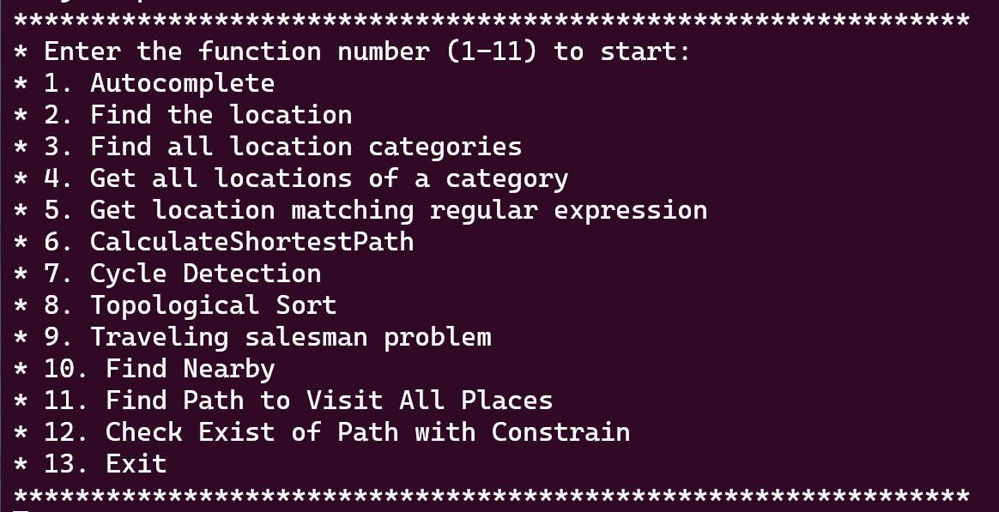
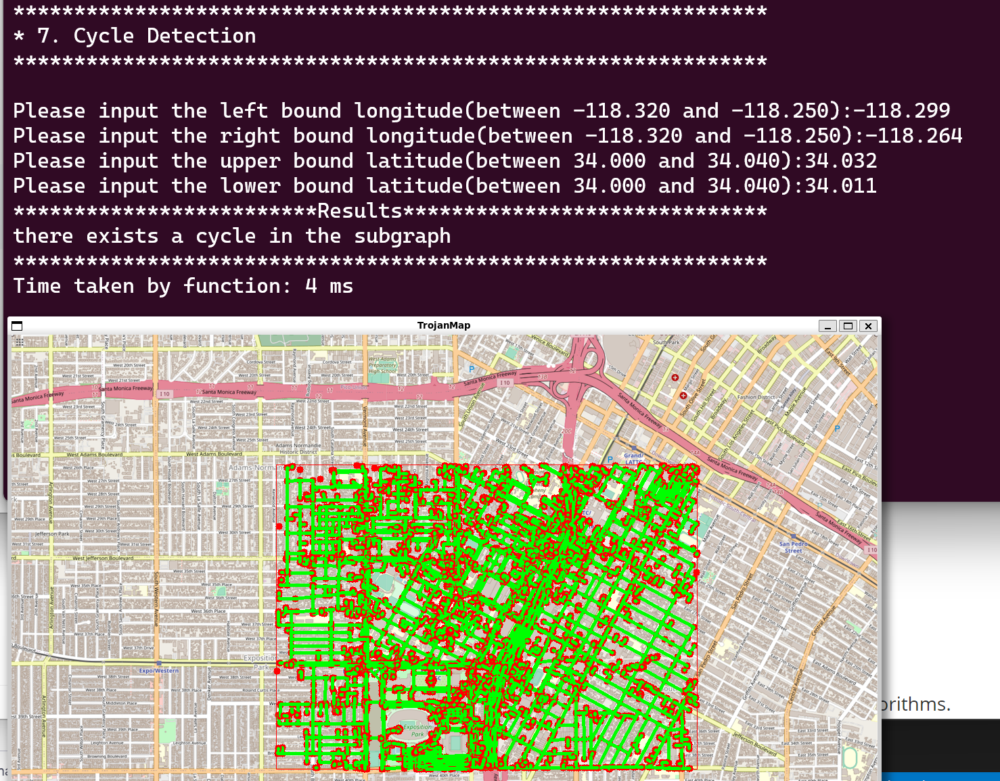
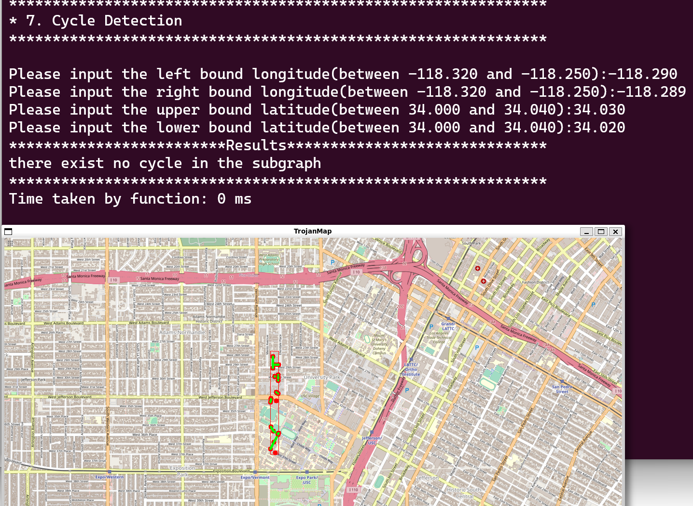
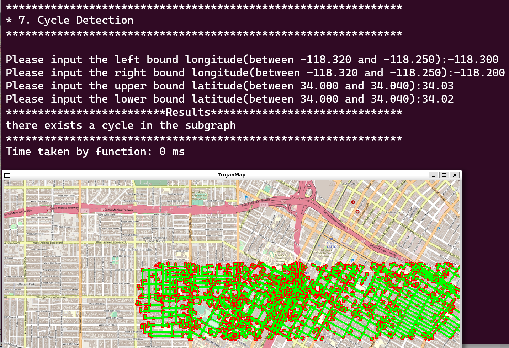
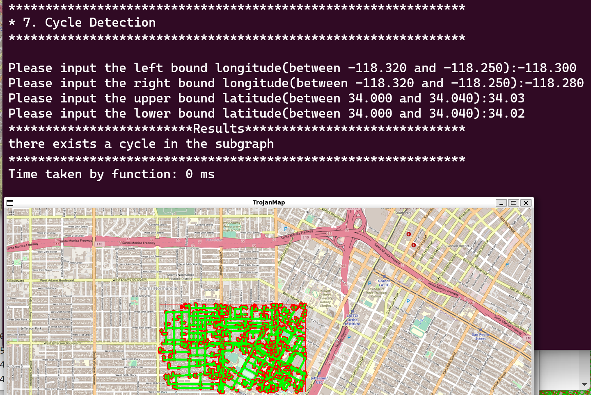
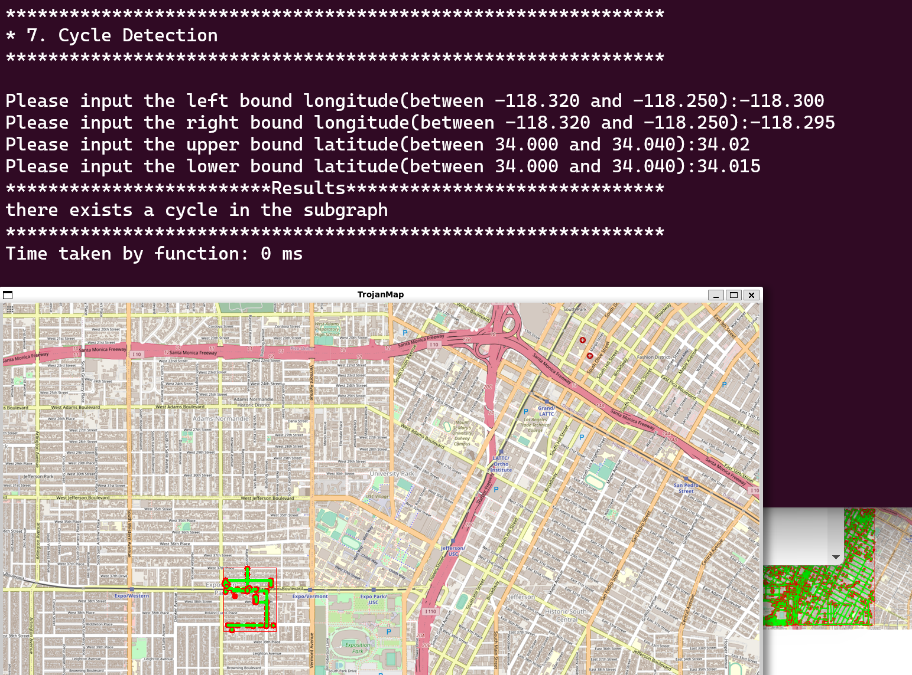
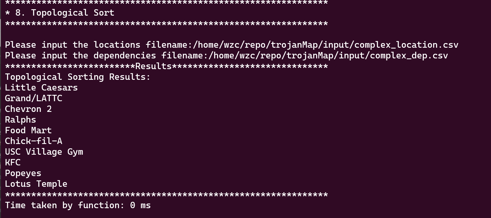
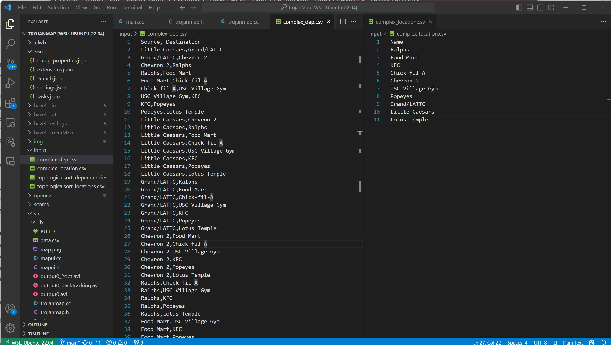

# Trojanmap Project Report

### Overview

This trojan map project models a map with several functionalities implemented. The major class `TrojanMap` is designed to handle various map-related tasks such as pathfinding, data retrieval, and analysis within a mapped network of locations (nodes). Here's a high-level overview of the design:

1. A `Node` class is defined to represent a location point on the map. It maintains the following curcial features related to a location:  "location ID", "latitude and longitude", "location name", "a list of its neighbors", and "a vector of attributes" (like restaurant, market, etc.)
2. A `TrojanMap` class models a map, and it mainly serves as a backend to provide several services related to a map. 
    - It manages a collection of `Node` objects and provides a range of mao-related functions.
    - It maintains a Map data structure, `std::unordered_map<std::string, Node> data`, to map a location ID to a unique `Node` object. 
    -  It provides a list of functions for users with several operations on a map GUI. (showing below)   
        

There are several functionalities needed to be implemented with efficient algorithms, such as shortest path Problem (Dijkstra, Bellman-Ford), and variants of Traveling Salesman problem are three major challenges involved in this project. Other map utilities are also implemented, including retrieving data based on node ID or name, auto-complete of a location name, regex-based search, edit distance calculation, and graph traversal and analysis. 

This `TrojanMap` class is a robust implementation of a graph-based map system, capable of handling a variety of graph-related tasks efficiently. It leverages standard C++ data structures and algorithms to provide a wide range of functionalities, from simple data retrieval to complex pathfinding and optimization tasks. 

### `TrojanMap` function details and run-time complexit Analysis

###### 1. Autocomplete(std::string name)

The function iterates over all elements in the `data` map (`for(const auto& tmp : data)`), where `data` is a map of all locations. If `n` is the number of elements (locations) in the `data` map, this iteration will be performed for `n` times.  

Inside the autocomplete functuin, it envoke a helper function `IsPrefixMatched` to check if a locaiton name matches the prefix `name`. If length of name is `m`, then this `IsPrefixMatched` has a complexity of O(m).

As a result, the Autocomplete has a time complexity of *O*(m × n).

###### 2. GetPosition(std::string name)

This function calls another three helper function (GetID, GetLat, GetLon) to find retrieve the location information of provided location name. This function is case-sensitive.

GetID will loop through the map data structure `data` to get ID of the specified locaton name. This takes *O*(mn) where `n` is number of nodes, and `m` is the average location name length.

GetLat and GetLon takes *O*(1) to get node object out of the `data` through indexing. 

Therefore, `GetPosition` should have a complexity *O*(m × n). 

###### 3. CalculateEditDistance

This functions takes two location names ( A and B) as input, and it calculates the minimum edit distance required to convert A to B.

Let `m, n` be the length of name A, B respectively. It takes *O*(m + n) operations to initialize a dynamic programming table with setting the first row and the first column.  The function then iterates through each cell of the table, filling it based on the recurrence relation. This involves two nested loops: the outer loop runs `m` times and the inner loop runs `n` times.

As a result, it has a complexity of *O*(m × n) ,  where the time complexity grows with the product of the lengths of the two input strings.

###### 4. FindClosestName

This function calls CalculateEditDistance to find the location name that results in minimum edit distance. It loops through the data structure`data` and apply the CalculateEditDistance between each location name and the target.

Therefore, this function has a complexity of *O(m × n ×k)*, where `k` represents the total number of nodes.

###### 5. GetAllCategories

It uses a data structure `set` to keep track of unique attribute names. The set insertion operation has a complexity of O(log *k*), where `k` is the number of elements currently in the set. However, since set elements are unique, `k` will be at most equal to the total number of unique categories across all nodes.

If there are `n` unique attributes and `m` nodes in total, then it has complexity of *O*(n × m).

###### 6. GetAllLocationsFromCategory

It iterates through the entire map `data` to collect the nodes with expected attrubutes. Each attribute is an unsort_set, whose `find` member function takes *O*(1). 

Therefore, given that there are `n` nodes, this function has a complexity of *O*(n)

###### 7.  GetLocationRegex

It iterates through the entire map `data` to apply `std::regex_match` function to check if a node matches the reges. The regex_match takes O(m), where m is average name length. 

Overal, this funciton has a complexity of *O*(m×n)

###### 8. CalculateShortestPath_Dijkstra,   CalculateShortestPath_Bellman_Ford

Our Table:

| Point A to Point B                 | Dijkstra | Bellman Ford |
| ---------------------------------- | -------- | ------------ |
| Ralphs - Target                    | 43 ms    | 7209 ms      |
| Chick-fil-A - Ralphs               | 92 ms    | 6094 ms      |
| North Residential College - Target | 29 ms    | 7184 ms      |
| Jefferson Park - Chick-fil-A       | 87 ms    | 8802 ms      |
| Jefferson Park - Ralphs            | 61 ms    | 8925 ms      |
| Trader Joe's - Target              | 6 ms     | 61 ms        |
| Bank of America - CAVA             | 7 ms     | 6474 ms      |
| Trader Joe's - Starbucks 3         | 9 ms     | 64 ms        |
| Bank of America - Target           | 6 ms     | 6670 ms      |
| Starbucks 3 - Bank of America      | 6 ms     | 6555 ms      |
| Trader Joe's - Amazon Hub Locker   | 3 ms     | 56 ms        |
| Jefferson Park - Starbucks 3       | 66 ms    | 8791 ms      |
| Starbucks 3 - Target               | 7 ms     | 6601 ms      |
| Ralphs - CAVA                      | 41 ms    | 7190 ms      |
| Starbucks 1 - Amazon Hub Locker    | 43 ms    | 6629 ms      |

###### 9. CycleDetection

It performs DFS to detect a cycle in a graph. In the worst case, every node and edge in the subgraph would be visited exactly once. This has complexity of O(n) if there's n nodes. For each node,  iterates over its neighbors and checks if each neighbor is in the subgraph. The combined complexity for each node is thus O(d×s), where  `d` represents the average degree of a node and `s` is the size of the subgraph. As a result, this function has complexity of O(n×d×s)

<u>Our results</u>:

###### 10. DeliveringTrojan

I use a map structure, `std::map<std::string, int> priorityList`, to keep track of the priority status of each node. The entry key is just the location name so that increasing priority takes O(1). It go through the entire `dependencies` vector to update the priorities of each location accordingly. 

Therefore, it has a complexity of O(n) if the given vector `dependencies` has a size of `n`. 

<u>Test result of scenario in which there're 10 locations</u>

###### 11. TravelingTrojan_Brute_force,  TravelingTrojan_Backtracking,  TravelingTrojan_2opt

The brute force approach has a complexity of O(n!), given that the size of provided locations has a size of `n`, due to that it simply goes through all permutations of the provided location ID lists. 

The early backtracking approach can improve the time complexity to complexity to a linear or polynomial compleixty of the input vector size by pruning branches as soon as it recognizes that they cannot lead to a valid solution.

The 2-opt heuristic algorithm *O*(*n*^2 × k), where `n` is the number of locations to be visited , and `k` is the number of times the algorithm iterates over all pairs of edges until no further improvements can be made. If the number of iterations is considered constant or logarithmic, the time complexity can be approximated as O*(*n^*2) or O*(*n*^2 log*n*)

Our results:

| Number of nodes | Time_Brute Force(ms) | Time_Early Backtracing(ms) | Time_2-Opt(ms) |
| --------------- | -------------------- | -------------------------- | -------------- |
| 6               | 0                    | 0                          | 0              |
| 7               | 4                    | 0                          | 0              |
| 8               | 30                   | 3                          | 0              |
| 9               | 207                  | 10                         | 0              |
| 10              | 2110                 | 36                         | 0              |

###### 12. FindNearby

It first calls `GetAllLocationsFromCategory` to get a list of location IDs with a specified attribute. This takes O(n), where n is total number of nodes.

Then it iterates through the list to check if each location locates within the range of the target.  Given that the list has a size of `m`, then this step takes O(m) in worst case.

The std::sort takes O(k log_k) since there're at most k locations needed to be returned. Therefore, the final complexity of FindNearby is:  O(m + n + k log_k).

- If k is small compared to n, then it has a complexity of O(n)
- If not, then it has a complexity of O(k log_k)

### Discussion

### Conclusion
